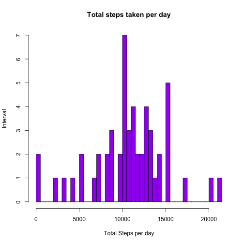
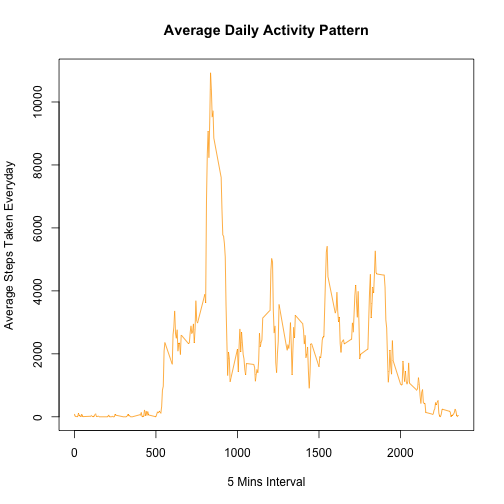
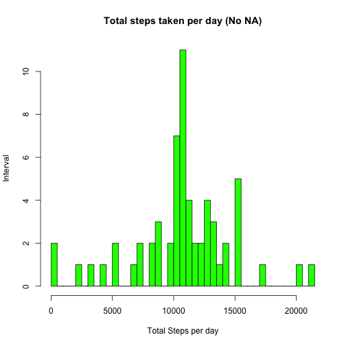
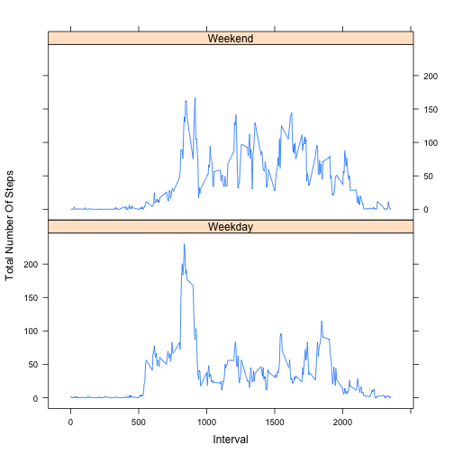
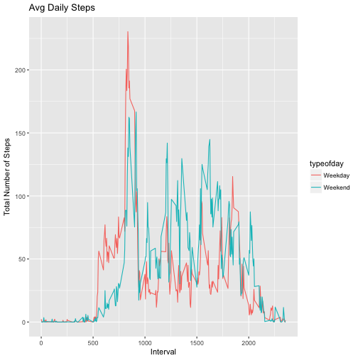

##********************** Course-5 Project-1 ***********************


**Globally setting the echo = TRUE**


###1. Loading and preprocessing the data


```r
library(datasets)
library(dplyr)
library(ggplot2)
library(knitr)
healthactivity <- read.csv("activity.csv") # read the table
# before plotting a histogram, convert the dates first from 'factor' to 'date' class
healthactivity$date <- as.Date(healthactivity$date, "%Y-%m-%d")
```


###2. What is mean total number of steps taken per day

**2(a). Calculate the total number of steps taken per day**

*calculate sum of steps on each day after removing NA values*

```r
totalstepsperday <- aggregate(steps ~ date, data = healthactivity, FUN = sum, na.rm = TRUE)
totalstepsperday # check the output
```

```
##          date steps
## 1  2012-10-02   126
## 2  2012-10-03 11352
## 3  2012-10-04 12116
## 4  2012-10-05 13294
## 5  2012-10-06 15420
## 6  2012-10-07 11015
## 7  2012-10-09 12811
## 8  2012-10-10  9900
## 9  2012-10-11 10304
## 10 2012-10-12 17382
## 11 2012-10-13 12426
## 12 2012-10-14 15098
## 13 2012-10-15 10139
## 14 2012-10-16 15084
## 15 2012-10-17 13452
## 16 2012-10-18 10056
## 17 2012-10-19 11829
## 18 2012-10-20 10395
## 19 2012-10-21  8821
## 20 2012-10-22 13460
## 21 2012-10-23  8918
## 22 2012-10-24  8355
## 23 2012-10-25  2492
## 24 2012-10-26  6778
## 25 2012-10-27 10119
## 26 2012-10-28 11458
## 27 2012-10-29  5018
## 28 2012-10-30  9819
## 29 2012-10-31 15414
## 30 2012-11-02 10600
## 31 2012-11-03 10571
## 32 2012-11-05 10439
## 33 2012-11-06  8334
## 34 2012-11-07 12883
## 35 2012-11-08  3219
## 36 2012-11-11 12608
## 37 2012-11-12 10765
## 38 2012-11-13  7336
## 39 2012-11-15    41
## 40 2012-11-16  5441
## 41 2012-11-17 14339
## 42 2012-11-18 15110
## 43 2012-11-19  8841
## 44 2012-11-20  4472
## 45 2012-11-21 12787
## 46 2012-11-22 20427
## 47 2012-11-23 21194
## 48 2012-11-24 14478
## 49 2012-11-25 11834
## 50 2012-11-26 11162
## 51 2012-11-27 13646
## 52 2012-11-28 10183
## 53 2012-11-29  7047
```


**2(b). Plot a histogram of total no of steps / day**


```r
hist(totalstepsperday$steps, main = "Total steps taken per day",
     xlab = "Total Steps per day",
     ylab = "Interval",
     col = "purple",
     breaks = 50)
```




**2(c).Calculate Mean and Median of the total number of steps taken per day**


```r
meansteps <- mean(totalstepsperday$steps)
meansteps # mean of total num of steps per day
```

```
## [1] 10766.19
```

```r
mediansteps <- median(totalstepsperday$steps)
mediansteps # median of total num of steps per day
```

```
## [1] 10765
```


###3. What is the average daily activity pattern?

**3(a). Make a time-series plot with an interval of 5 mins (x-axis)**
**against the avg of total steps taken per day (y-axis). Use type = "l"**


```r
fiveminstepsperday <- aggregate(steps ~ interval, data = healthactivity, FUN = sum, na.rm = TRUE)
plot(x = fiveminstepsperday$interval, y = fiveminstepsperday$steps, type = "l",
     main = "Average Daily Activity Pattern",
     xlab = "5 Mins Interval",
     ylab = "Average Steps Taken Everyday",
     col = "orange")
```




**3(b). Which 5-minute interval contains the maximum number of steps **

*finding out that which interval had max steps*


```r
maxsteps <- fiveminstepsperday$interval[which.max(fiveminstepsperday$steps)]
maxsteps
```

```
## [1] 835
```

```r
# check how many steps were taken on the max-interval duration
maxstepstaken <- max(fiveminstepsperday$steps)
maxstepstaken
```

```
## [1] 10927
```


###4. Imputing missing values


**4(a). Calculate the total number of missing values in the dataset**


```r
totalna <- sum(is.na(healthactivity$steps))
totalna
```

```
## [1] 2304
```


**4(b). Devise a strategy to fill in NA values**

*My strategy is to fill in all the NA values with the 5-mins interval steps value*


**4(c). Fill in all of the missing values in the new dataset**


```r
healthactivity3 <- healthactivity
nas <- is.na(healthactivity3$steps)
avg_interval <- tapply(healthactivity3$steps, healthactivity3$interval, mean, na.rm=TRUE)
healthactivity3$steps[nas] <- avg_interval[as.character(healthactivity3$interval[nas])]
sum(is.na(healthactivity3))
```

```
## [1] 0
```


**4(d). Plot a histogram with no NA values of total no of steps / day**


```r
totalstepsperday2 <- aggregate(steps ~ date, data = healthactivity3, FUN = sum, na.rm = TRUE)
hist(totalstepsperday2$steps, main = "Total steps taken per day (No NA)",
     xlab = "Total Steps per day",
     ylab = "Interval",
     col = "green",
     breaks = 50)
```



```r
# Mean & Median
meansteps2 <- mean(totalstepsperday2$steps)
meansteps2 # mean of total num of steps per day
```

```
## [1] 10766.19
```

```r
mediansteps2 <- median(totalstepsperday2$steps)
mediansteps2 # median of total num of steps per day
```

```
## [1] 10766.19
```

```r
# ANALYSIS - Mean remains the same as prior to imputation, 
# while the median value increased slightly.
# impact of imputing missing data 
summary(healthactivity3) # impact in the steps/interval changing for the days where there were NA
```

```
##      steps             date               interval     
##  Min.   :  0.00   Min.   :2012-10-01   Min.   :   0.0  
##  1st Qu.:  0.00   1st Qu.:2012-10-16   1st Qu.: 588.8  
##  Median :  0.00   Median :2012-10-31   Median :1177.5  
##  Mean   : 37.38   Mean   :2012-10-31   Mean   :1177.5  
##  3rd Qu.: 27.00   3rd Qu.:2012-11-15   3rd Qu.:1766.2  
##  Max.   :806.00   Max.   :2012-11-30   Max.   :2355.0
```

```r
summary(totalstepsperday) # impact inthe steps/day before imputing NA values
```

```
##       date                steps      
##  Min.   :2012-10-02   Min.   :   41  
##  1st Qu.:2012-10-16   1st Qu.: 8841  
##  Median :2012-10-29   Median :10765  
##  Mean   :2012-10-30   Mean   :10766  
##  3rd Qu.:2012-11-16   3rd Qu.:13294  
##  Max.   :2012-11-29   Max.   :21194
```

```r
summary(totalstepsperday2) # impact in the steps/day before imputing NA values
```

```
##       date                steps      
##  Min.   :2012-10-01   Min.   :   41  
##  1st Qu.:2012-10-16   1st Qu.: 9819  
##  Median :2012-10-31   Median :10766  
##  Mean   :2012-10-31   Mean   :10766  
##  3rd Qu.:2012-11-15   3rd Qu.:12811  
##  Max.   :2012-11-30   Max.   :21194
```


###5. Are there differences in activity patterns between weekdays and weekends?


**5(a). Create a new factor variable in the dataset with two levels ??? ???weekday??? and ???weekend???** 
** indicating whether a given date is a weekday or weekend day**


```r
day <- weekdays(healthactivity3$date) # find out which day it is
#mutate will help in adding new variable by keeping the existing ones. using ifelse() it can be done.
healthactivity3 <- healthactivity3 %>% mutate(typeofday = ifelse(day == "Saturday" | day == "Sunday", "Weekend", "Weekday"))
```


**5(b). Make a panel plot (type =l) with 5-min interval (x-axis) and** 
**avg no of steps taken (y-axis) separately for weekdays and weekends**


```r
fiveminstepsperday2 <- aggregate(steps ~ interval + typeofday, data = healthactivity3, FUN = mean, na.rm = TRUE)
library(lattice)
#plotting using xyplot()
xyplot(steps ~ interval | typeofday,
       layout = c(1, 2),
       xlab = "Interval",
       ylab = " Total Number Of Steps",
       type = "l",
       lty = 1,
       data = fiveminstepsperday2)
```



**Another way using ggplot() for my own reference (NOT TO BE EVALUATED)**


```r
ggplot(fiveminstepsperday2, aes(x = interval , y = steps, col = typeofday)) +
      geom_line() +
      labs(title = "Avg Daily Steps", x = "Interval", y = "Total Number of Steps")
```



```r
      facet_grid(.~ typeofday)
```

```
## <ggproto object: Class FacetGrid, Facet>
##     compute_layout: function
##     draw_back: function
##     draw_front: function
##     draw_labels: function
##     draw_panels: function
##     finish_data: function
##     init_scales: function
##     map: function
##     map_data: function
##     params: list
##     render_back: function
##     render_front: function
##     render_panels: function
##     setup_data: function
##     setup_params: function
##     shrink: TRUE
##     train: function
##     train_positions: function
##     train_scales: function
##     super:  <ggproto object: Class FacetGrid, Facet>
```


###For submission and evaluation
